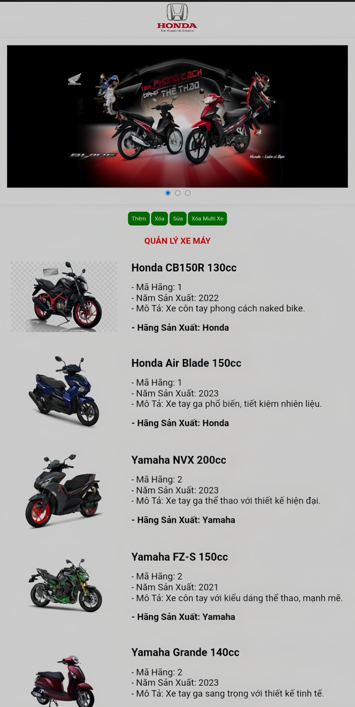

# 🌟 Motorcycle Management System - QLXemMay 🌟

Welcome to the **Motorcycle Management System (QuanLyXemMay)**, a web application built with **PHP** and **CSS** designed to efficiently manage motorcycle information, including details, maintenance records, and inventory. This project aims to streamline motorcycle management processes and enhance user experience.

---

## 📸 Screenshots


*Screenshot of the motorcycle management interface showcasing key functionalities.*

---

## 🧩 Features

- **Motorcycle Records**: Add, edit, and delete motorcycle information.
- **Maintenance Tracking**: Monitor maintenance records and schedules.
- **Inventory Management**: Manage available motorcycles in stock.
- **Responsive Design**: Ensures usability across various devices.

---

## 🚀 Getting Started

To get started with this project, follow the steps below:

### Prerequisites

- **PHP** installed on your server.
- Basic knowledge of **CSS** and **HTML** for customization (if needed).

### Installation

1. Clone the repository:
   ```bash
   git clone https://github.com/Heliophile0208/quanlyxemay
